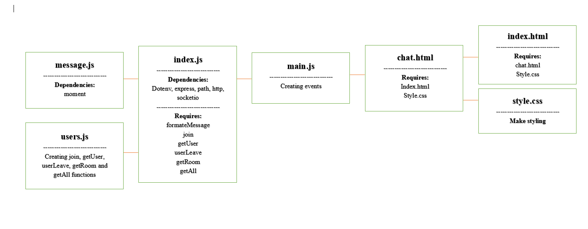

# Realtime-Chat-Application

## Documintation

This project is a chat application that contains several rooms and let multiple users to get in any room selected.

This project have both backend and frontend interfaces.

Dependencies used:

- dotenv
- express
- moment
- socket.io

There are an events connection between server(index.js) and main.js

UML diagram:

